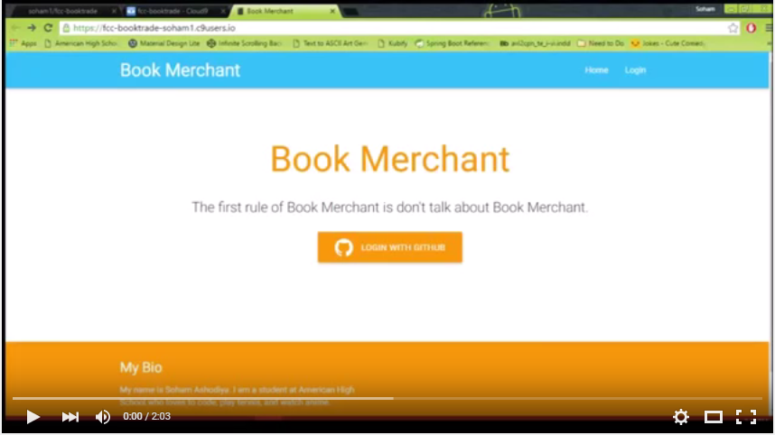

#Book Trading Application

This is a solution for http://www.freecodecamp.com/challenges/manage-a-book-trading-club

User Story: I can view all books posted by every user.

User Story: I can add a new book.

User Story: I can update my settings to store my full name, city, and state.

User Story: I can propose a trade and wait for the other user to accept the trade.

##Screenshots:

###Homepage

###User is redirected to My Books after logging in. (with Github account)

###If you click one of your books, there will be an option to delete it.

###Adding a book.

###After adding, the new book is shown on My Books.

###All Books (Shows books that you do not own)

###If you click on one of the books, there will be an option to request for the book.

###When that book's owner checks that book in My Books, he or she will be able to accept or decline the request.

###If the user accepts, the book will be deleted from his or her My Books and added to the requester's My Books page.

###The gears on the top right let you change your user profile.

##Demo

##Technologies Used:
- Node.js
- Express
- MongoDB
- Passport